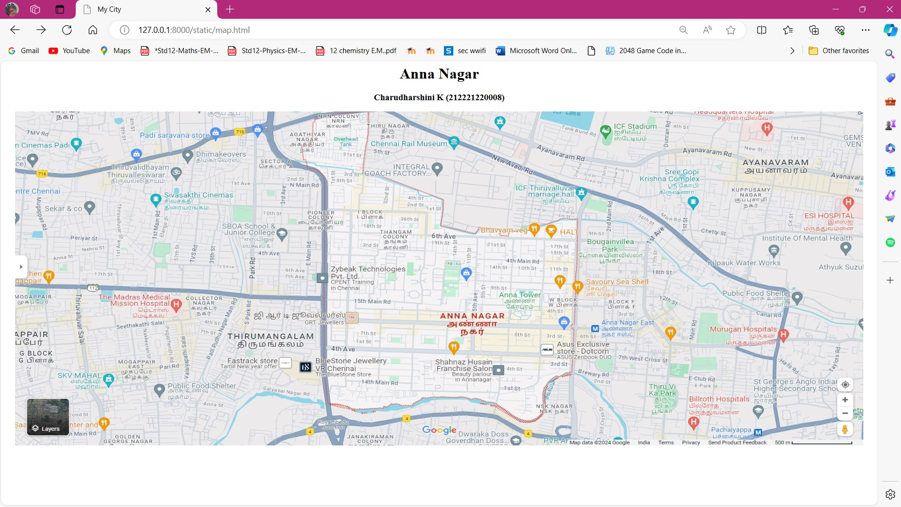
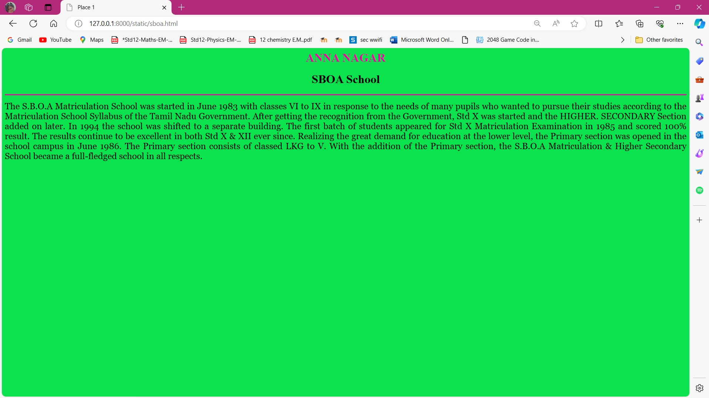
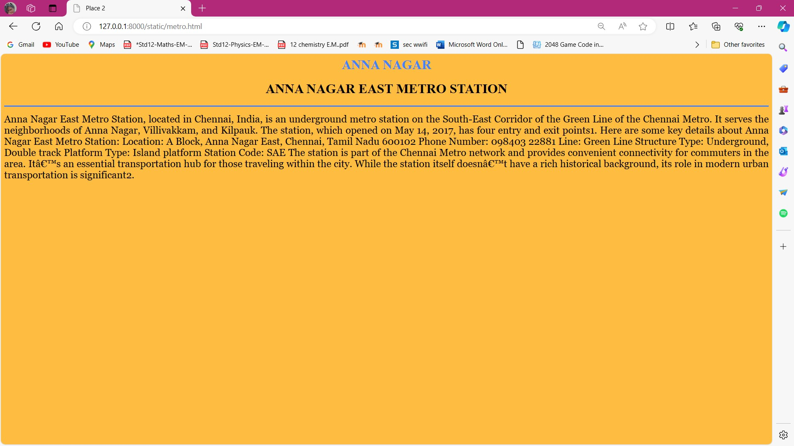
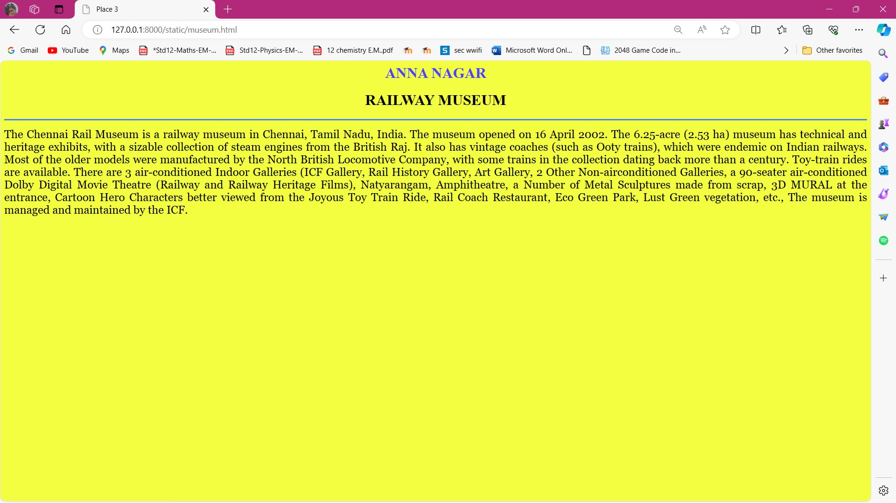
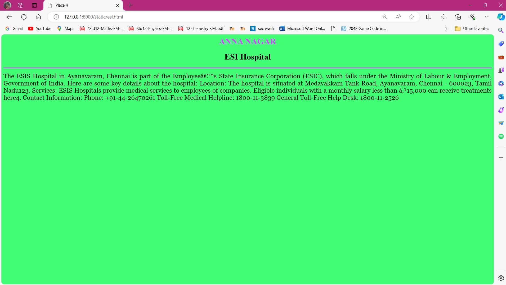
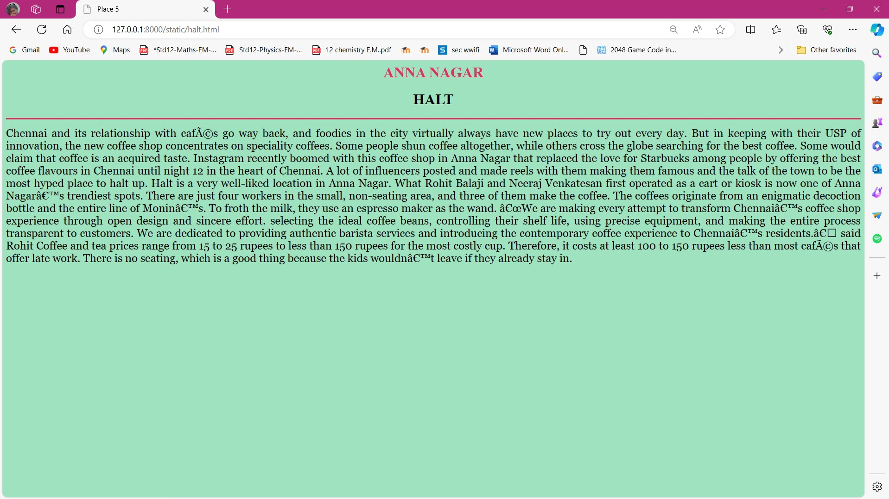

# Ex04 Places Around Me
## Date: 

## AIM
To develop a website to display details about the places around my house.

## DESIGN STEPS

### STEP 1
Create a Django admin interface.

### STEP 2
Download your city map from Google.

### STEP 3
Using ```<map>``` tag name the map.

### STEP 4
Create clickable regions in the image using ```<area>``` tag.

### STEP 5
Write HTML programs for all the regions identified.

### STEP 6
Execute the programs and publish them.

## CODE
### map.html
```
<html>
<head>
<title>My City</title>
</head>
<body>
<h1 align="center">
<font color="Black"><b>Anna Nagar</b></font>
</h1>
<h3 align="center">
<font color="Black"><b>Charudharshini K (212221220008) </b></font>
</h3>
<center>

<map name="MyCity">
    
<area shape="rect" coords="551,468,249,168" href="sboa.html" title="SBOA School">
<area shape="circle" coords="1825,265,177" href="esi.html" title="ESI Hospital">
<area shape="circle" coords="1298,525,100" href="metro.html" title="Anna Nagar East Metro Station">
<area shape="circle" coords="1212,305,100" href="halt.html" title="Halt">
<area shape="rect" coords="871,53,1068,117" href="museum.html" title="Railway museum">
</map>
</center>
</body>
</html>

```
### sboa.html
```
<html>
<head>
<title>Place 1</title>
</head>
<body bgcolor="#0BE24E">
<h1 align="center">
<font color="#E20B9F"><b>ANNA NAGAR</b></font>
</h1>
<h1 align="center">
<font color="black"><b>SBOA School</b></font>
</h1>
<hr size="3" color="#E20B9F">
<p align="justify">
<font face="Georgia" size="5">
    The S.B.O.A Matriculation School was started in June 1983 with classes VI to IX in response to the needs of many pupils who wanted to pursue their studies according to the Matriculation School Syllabus of the Tamil Nadu Government. After getting the recognition from the Government, Std X was started and the HIGHER. SECONDARY Section added on later. In 1994 the school was shifted to a separate building. The first batch of students appeared for Std X Matriculation Examination in 1985 and scored 100% result. The results continue to be excellent in both Std X & XII ever since.
    Realizing the great demand for education at the lower level, the Primary section was opened in the school campus in June 1986. The Primary section consists of classed LKG to V. With the addition of the Primary section, the S.B.O.A Matriculation & Higher Secondary School became a full-fledged school in all respects.
</font>
</p>
</body>
</html>
```
### museum.html
```
<html>
<head>
<title>Place 3</title>
</head>
<body bgcolor="#F4FE41">
<h1 align="center">
<font color="#4B41FE"><b>ANNA NAGAR</b></font>
</h1>
<h1 align="center">
<font color="black"><b>RAILWAY MUSEUM</b></font>
</h1>
<hr size="3" color="#4182FE">
<p align="justify">
<font face="Georgia" size="5">
    The Chennai Rail Museum is a railway museum in Chennai, Tamil Nadu, India. The museum opened on 16 April 2002. The 6.25-acre (2.53 ha) museum has technical and heritage exhibits, with a sizable collection of steam engines from the British Raj. It also has vintage coaches (such as Ooty trains), which were endemic on Indian railways. Most of the older models were manufactured by the North British Locomotive Company, with some trains in the collection dating back more than a century. Toy-train rides are available. There are 3 air-conditioned Indoor Galleries (ICF Gallery, Rail History Gallery, Art Gallery, 2 Other Non-airconditioned Galleries, a 90-seater air-conditioned Dolby Digital Movie Theatre (Railway and Railway Heritage Films), Natyarangam, Amphitheatre, a Number of Metal Sculptures made from scrap, 3D MURAL at the entrance, Cartoon Hero Characters better viewed from the Joyous Toy Train Ride, Rail Coach Restaurant, Eco Green Park, Lust Green vegetation, etc., The museum is managed and maintained by the ICF.
</font>
</p>
</body>
</html>
```
### halt.html
```
<html>
<head>
<title>Place 5</title>
</head>
<body bgcolor="#9FE2BF">
<h1 align="center">
<font color="#DE3163"><b>ANNA NAGAR</b></font>
</h1>
<h1 align="center">
<font color="black"><b>HALT</b></font>
</h1>
<hr size="3" color="#DE3163">
<p align="justify">
<font face="Georgia" size="5">
    Chennai and its relationship with cafés go way back, and foodies in the city virtually always have new places to try out every day. But in keeping with their USP of innovation, the new coffee shop concentrates on speciality coffees. Some people shun coffee altogether, while others cross the globe searching for the best coffee. Some would claim that coffee is an acquired taste.

Instagram recently boomed with this coffee shop in Anna Nagar that replaced the love for Starbucks among people by offering the best coffee flavours in Chennai until night 12 in the heart of Chennai. A lot of influencers posted and made reels with them making them famous and the talk of the town to be the most hyped place to halt up.

Halt is a very well-liked location in Anna Nagar. What Rohit Balaji and Neeraj Venkatesan first operated as a cart or kiosk is now one of Anna Nagar’s trendiest spots.

There are just four workers in the small, non-seating area, and three of them make the coffee. The coffees originate from an enigmatic decoction bottle and the entire line of Monin’s. To froth the milk, they use an espresso maker as the wand.

“We are making every attempt to transform Chennai’s coffee shop experience through open design and sincere effort. selecting the ideal coffee beans, controlling their shelf life, using precise equipment, and making the entire process transparent to customers. We are dedicated to providing authentic barista services and introducing the contemporary coffee experience to Chennai’s residents.” said Rohit

Coffee and tea prices range from 15 to 25 rupees to less than 150 rupees for the most costly cup. Therefore, it costs at least 100 to 150 rupees less than most cafés that offer late work. There is no seating, which is a good thing because the kids wouldn’t leave if they already stay in.
</font>
</p>
</body>
</html>
```
### metro.html
```
<html>
<head>
<title>Place 2</title>
</head>
<body bgcolor="#FEBD41">
<h1 align="center">
<font color="#4182FE"><b>ANNA NAGAR</b></font>
</h1>
<h1 align="center">
<font color="black"><b>ANNA NAGAR EAST METRO STATION</b></font>
</h1>
<hr size="3" color="#4182FE">
<p align="justify">
<font face="Georgia" size="5">
    Anna Nagar East Metro Station, located in Chennai, India, is an underground metro station on the South-East Corridor of the Green Line of the Chennai Metro. It serves the neighborhoods of Anna Nagar, Villivakkam, and Kilpauk. The station, which opened on May 14, 2017, has four entry and exit points1.

    Here are some key details about Anna Nagar East Metro Station:
    
    Location: A Block, Anna Nagar East, Chennai, Tamil Nadu 600102
    Phone Number: 098403 22881
    Line: Green Line
    Structure Type: Underground, Double track
    Platform Type: Island platform
    Station Code: SAE
    The station is part of the Chennai Metro network and provides convenient connectivity for commuters in the area. It’s an essential transportation hub for those traveling within the city. While the station itself doesn’t have a rich historical background, its role in modern urban transportation is significant2.
</font>
</p>
</body>
</html>
```
### esi.html
```
<html>
<head>
<title>Place 4</title>
</head>
<body bgcolor="#41FE75">
<h1 align="center">
<font color="#D441FE"><b>ANNA NAGAR</b></font>
</h1>
<h1 align="center">
<font color="black"><b>ESI Hospital</b></font>
</h1>
<hr size="3" color="#D441FE">
<p align="justify">
<font face="Georgia" size="5">
    The ESIS Hospital in Ayanavaram, Chennai is part of the Employee’s State Insurance Corporation (ESIC), which falls under the Ministry of Labour & Employment, Government of India. Here are some key details about the hospital:

Location: The hospital is situated at Medavakkam Tank Road, Ayanavaram, Chennai - 600023, Tamil Nadu123.
Services: ESIS Hospitals provide medical services to employees of companies. Eligible individuals with a monthly salary less than ₹15,000 can receive treatments here4.
Contact Information:
Phone: +91-44-26470261
Toll-Free Medical Helpline: 1800-11-3839
General Toll-Free Help Desk: 1800-11-2526
</font>
</p>
</body>
</html>
```
## OUTPUT

 
 
 
 



## RESULT
The program for implementing image maps using HTML is executed successfully.
